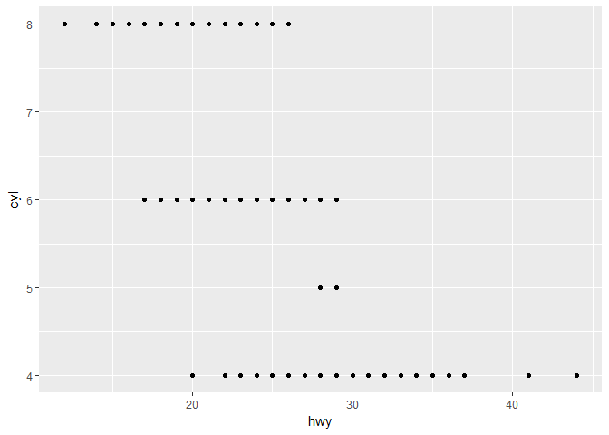
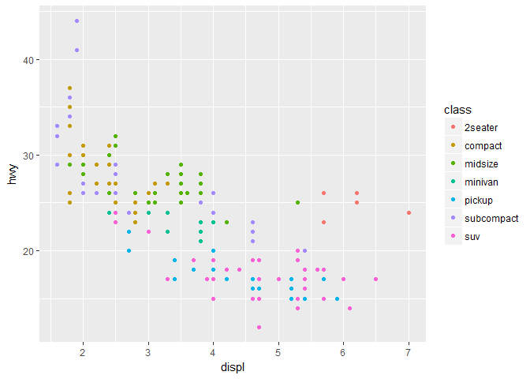
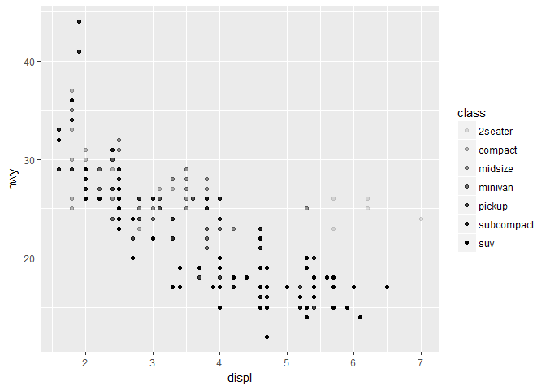
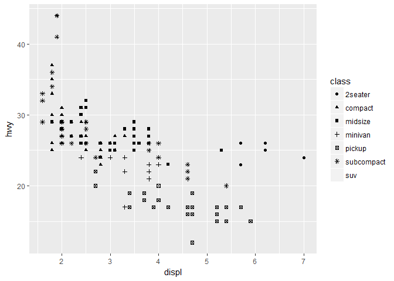
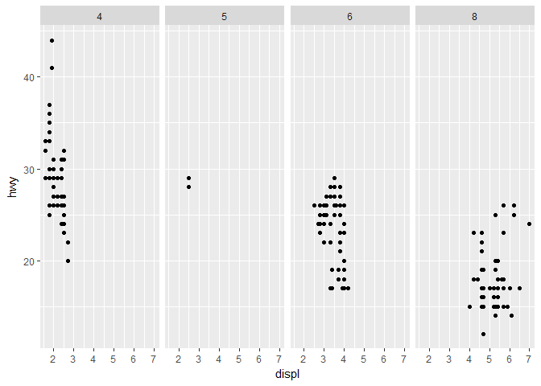

# ggplot2 Introduction
CB  
Tuesday, April 25, 2017  


## Chapter 3

### 3.1
Load `tidyverse` packages.

```r
library("tidyverse")
```

### 3.2

#### 3.2.1

Look at the `mpg` data frame and check out its help file.

```r
mpg
```

```
## # A tibble: 234 × 11
##    manufacturer      model displ  year   cyl      trans   drv   cty   hwy
##           <chr>      <chr> <dbl> <int> <int>      <chr> <chr> <int> <int>
## 1          audi         a4   1.8  1999     4   auto(l5)     f    18    29
## 2          audi         a4   1.8  1999     4 manual(m5)     f    21    29
## 3          audi         a4   2.0  2008     4 manual(m6)     f    20    31
## 4          audi         a4   2.0  2008     4   auto(av)     f    21    30
## 5          audi         a4   2.8  1999     6   auto(l5)     f    16    26
## 6          audi         a4   2.8  1999     6 manual(m5)     f    18    26
## 7          audi         a4   3.1  2008     6   auto(av)     f    18    27
## 8          audi a4 quattro   1.8  1999     4 manual(m5)     4    18    26
## 9          audi a4 quattro   1.8  1999     4   auto(l5)     4    16    25
## 10         audi a4 quattro   2.0  2008     4 manual(m6)     4    20    28
## # ... with 224 more rows, and 2 more variables: fl <chr>, class <chr>
```

```r
?ggplot2::mpg
```

#### 3.2.2

Graph `displ` on the x-axis and `hwy` on the y-axis.

```r
ggplot(mpg) +
  geom_point(aes(x = displ, y = hwy))
```

<!-- -->

#### 3.2.3

Create a ggplot2 graph template.
```
ggplot(<DATA>) + 
  <GEOM_FUNCTION>(aes(<MAPPINGS>))
```

#### 3.2.4

1. `ggplot(data = mpg)` creates an empty plot. 
<!-- -->

2. There are 32 rows and 11 columns in `mtcars`. 

```r
nrow(mtcars)
```

```
## [1] 32
```

```r
ncol(mtcars)
```

```
## [1] 11
```

3. The `drv` variable describes how the car wheels are being powered and driven (i.e. front-wheel drive). 

4. `hwy` vs `cyl` scatterplot

```r
ggplot(mpg) + 
  geom_point(aes(x = hwy, y = cyl))
```

<!-- -->

5. A scatterplot of `class` vs `drv` is not useful because both of these are discrete variables so the graph doesn't really show the data spread. All of the points at each intersection are just stacked on top of each other and appear as one point. 

```r
ggplot(mpg) + 
  geom_point(aes(x = class, y = drv))
```

<!-- -->

### 3.3

Add a third variable to a plot as an aesthetic factor. 

```r
ggplot(mpg) + 
  geom_point(aes(x = displ, y = hwy, color = class))
```

<!-- -->

Different aesthetic options include `color`, `size`, `alpha`, and `shape`. `alpha` changes the transparency of points and can also be used to add a third variable to a plot.

```r
ggplot(mpg) + 
  geom_point(aes(x = displ, y = hwy, alpha = class))
```

<!-- -->

Be careful when plotting with `shape` because ggplot2 only uses six shapes at once. If there are more than six categories in a variable assigned to `shape`, some of the categories will not be plotted. 

```r
ggplot(mpg) +
  geom_point(aes(x = displ, y = hwy, shape = class))
```

```
## Warning: The shape palette can deal with a maximum of 6 discrete values
## because more than 6 becomes difficult to discriminate; you have 7.
## Consider specifying shapes manually if you must have them.
```

```
## Warning: Removed 62 rows containing missing values (geom_point).
```

<!-- -->

All of these aesthetic factors can also be manipulated without being assigned to a third variable. In this context, the aesthetic arguments are specified outside the `aes` argument. 

```r
ggplot(mpg) + 
  geom_point(aes(x = displ, y = hwy), color = "blue")
```

<!-- -->

#### 3.3.1

```
ggplot(data = mpg) + 
  geom_point(mapping = aes(x = displ, y = hwy, color = "blue"))
```
1. The points are not blue because the `color` argument is included in the `aes` argument. In this location, the `color` code appears to create a `color` variable equal to "blue" for all data values. 

2. `manufacturer`, `model`, `year`, `cyl`, `trans`, `drv`, `fl`, and `class` are categorical variables. `displ`, `cty`, and `hwy` are continuous variables. You can see this information when you run `mpg` by looking at the values for each of these variables.  

3. continuous variable mapped to `color`

```r
ggplot(mpg) + 
  geom_point(aes(x = displ, y = hwy, color = cty))
```

<!-- -->

continuous variable mapped to `size`

```r
ggplot(mpg) + 
  geom_point(aes(x = displ, y = hwy, size = cty))
```

<!-- -->

continuous variable mapped to `shape`
```
ggplot(mpg) + 
  geom_point(aes(x = displ, y = hwy, shape = cty))
```
"Error: A continuous variable can not be mapped to shape"

`color` creates a color scale to use when plotting continuous variables, but uses distinct colors when plotting categorical variables. `size` appears to still use distinct point sizes when plotting continuous variables, as it does when plotting categorical variables. However, the point sizes are arranged intuitively so that small points match small continuous variable values and large points match large continuous variable values. `shape` does not work to plot continuous variables like it does to plot categorical variables and will produce an error message if you attempt to do so. 

4. Mapping the same variable to multiple aesthetics will plot that variable using both of those aesthetic options.

```r
ggplot(mpg) + 
  geom_point(aes(x = displ, y = hwy, size = cty, color = cty))
```

<!-- -->

5. The `stroke` aesthetic modifies the width of the color border on shapes. It only works on shapes that have borders (0-14 and 21-24). 

6. If you map an aesthetic to a logical argument, R will apply the logical argument to all points and then apply the aesthetic to the outcome of the logical argument. For example, R has plotted all points satisfying `displ < 5` as one color and all points not satisfying `displ < 5` as another color in the below graph.

```r
ggplot(mpg) + 
  geom_point(aes(x = cty, y = hwy, color = displ < 5))
```

<!-- -->

### 3.4

Punctuation is very important. Look at the help files and online forums for troubleshooting help.

### 3.5

`facet_wrap` can also be used to add an additional variable to a plot. This will create subplots based on that variable.

```r
ggplot(mpg) + 
  geom_point(aes(x = displ, y =hwy)) + 
  facet_wrap(~ class, nrow = 2)
```

<!-- -->

To create subplots based on two variables, use `facet_grid`. 

```r
ggplot(mpg) + 
  geom_point(aes(x = displ, y = hwy)) + 
  facet_grid(drv ~ cyl)
```

<!-- -->

#### 3.5.1

1. Faceting on a continuous variable will create individual subplots for each value of that continuous variable. This results in a large number of subplots and probably isn't very useful.

```r
ggplot(mpg) + 
  geom_point(aes(x = displ, y = hwy)) + 
  facet_wrap(~ cty)
```

<!-- -->

2. Empty cells in a plot with `facet_grid(drv ~ cyl)` mean that there are no data points matching that combination of values. For instance, there are no cars in the dataset with four wheel drive and 5 cylinders. These empty cells match intersections on the below plot where there are no points.

```r
ggplot(mpg) + 
  geom_point(aes(x = drv, y = cyl))
```

<!-- -->

3. The first code creates a plot of `displ` vs `hwy` that is faceted by `drv` arranged in rows. The second code creates a plot of `displ` vs `hwy` that is faceted by `cyl` arranged in columns. The `.` fills in for one of the variables in `facet_grid` so that one variable can be faceted in a specific orientation using `facet_grid`. 

```r
ggplot(mpg) + 
  geom_point(aes(x = displ, y = hwy)) + 
  facet_grid(drv ~ .)
```

<!-- -->

```r
ggplot(mpg) + 
  geom_point(aes(x = displ, y = hwy)) + 
  facet_grid(. ~ cyl)
```

<!-- -->

4. Faceting allows you to separately and simultaneously look at plots of two variables separated by a third variable, which is useful to individually analyze trends by the third variable. It is more difficult to accomplish this using `color` because the points blur together more and are not really separated by the third variable. However, faceting does not allow for direct comparison of categories within the third variable like `color` does by keeping everything on one graph. With a larger dataset, faceting would likely be much more useful than `color` to provide a clearer view of the data. 

5. `nrow` specifies the number of rows shown in the output while `ncol` specifies the number of columns shown in the output. `as.table` and `dir` also control individual pane layout. `facet_grid` doesn't have `nrow` and `ncol` because its dimensions are set with one variable on each axis, so the number of rows is set by one variable and the number of columns is set by the other variable. 

6. Putting the variable with more unique levels in the columns of `facet_grid` would make the output easier to read because standard paper is longer than it is wide. 
