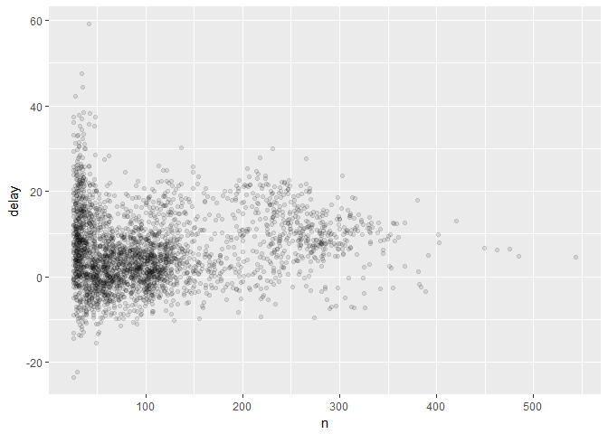

# dplyr Continued + Script Workflow
CB  
Tuesday, May 16, 2017  


## Chapter 5

### 5.6 `summarise()`

`summarise()` is used to summarize data and is most useful with `group_by()`. Together, these commands will create a grouped summary where the data is summarized by specified groups. 


```r
summarise(flights, delay = mean(dep_delay, na.rm = TRUE))
```

```
## # A tibble: 1 × 1
##      delay
##      <dbl>
## 1 12.63907
```

```r
by_day <- group_by(flights, year, month, day)
summarise(by_day, delay = mean(dep_delay, na.rm = TRUE))
```

```
## Source: local data frame [365 x 4]
## Groups: year, month [?]
## 
##     year month   day     delay
##    <int> <int> <int>     <dbl>
## 1   2013     1     1 11.548926
## 2   2013     1     2 13.858824
## 3   2013     1     3 10.987832
## 4   2013     1     4  8.951595
## 5   2013     1     5  5.732218
## 6   2013     1     6  7.148014
## 7   2013     1     7  5.417204
## 8   2013     1     8  2.553073
## 9   2013     1     9  2.276477
## 10  2013     1    10  2.844995
## # ... with 355 more rows
```

#### 5.6.1 Combining multiple operations with the pipe

Investigate the relationship between distance and average delay by location with and without using the pipe. 

**Without the pipe:**

```r
by_dest <- group_by(flights, dest)
delay <- summarise(by_dest,
                   count = n(),
                   dist = mean(distance, na.rm = TRUE),
                   delay = mean(arr_delay, na.rm = TRUE))
delay <- filter(delay, count > 20, dest != "HNL")

ggplot(delay, aes(x = dist, y = delay)) + 
  geom_point(aes(size = count), alpha = 1/3) + 
  geom_smooth(se = FALSE)
```

```
## `geom_smooth()` using method = 'loess'
```

<!-- -->

In this process, the flights are grouped by destination; distance, average delay, and number of flights are calculated with `summarise()`; and noisy points and Honolulu airport are removed with `filter()`. 

**With the pipe**

```r
delays <- flights %>% 
  group_by(dest) %>% 
  summarise(
    count = n(),
    dist = mean(distance, na.rm = TRUE),
    delay = mean(arr_delay, na.rm = TRUE)
  ) %>% 
  filter(count > 20, dest != "HNL")
```

Using the pipe makes code more readable and also simplifies the flow of code because you don't have to name intermediate variables between each function. Instead, the pipe feeds the result of the previous function into the next function. 

However, the pipe cannot be used within ggplot2 as it was developed after ggplot2. 

**`Ctrl` + `Shift` + `M` is a shortcute for the pipe. `%>%`**

#### 5.6.2 Missing values

Aggregation functions include missing values if there are any missing values in the input, so it may be helpful to remove these from the output by specifying `na.rm = TRUE`. 


```r
flights %>% 
  group_by(year, month, day) %>% 
  summarise(mean = mean(dep_delay))
```

```
## Source: local data frame [365 x 4]
## Groups: year, month [?]
## 
##     year month   day  mean
##    <int> <int> <int> <dbl>
## 1   2013     1     1    NA
## 2   2013     1     2    NA
## 3   2013     1     3    NA
## 4   2013     1     4    NA
## 5   2013     1     5    NA
## 6   2013     1     6    NA
## 7   2013     1     7    NA
## 8   2013     1     8    NA
## 9   2013     1     9    NA
## 10  2013     1    10    NA
## # ... with 355 more rows
```

```r
flights %>% 
  group_by(year, month, day) %>% 
  summarise(mean = mean(dep_delay, na.rm = TRUE))
```

```
## Source: local data frame [365 x 4]
## Groups: year, month [?]
## 
##     year month   day      mean
##    <int> <int> <int>     <dbl>
## 1   2013     1     1 11.548926
## 2   2013     1     2 13.858824
## 3   2013     1     3 10.987832
## 4   2013     1     4  8.951595
## 5   2013     1     5  5.732218
## 6   2013     1     6  7.148014
## 7   2013     1     7  5.417204
## 8   2013     1     8  2.553073
## 9   2013     1     9  2.276477
## 10  2013     1    10  2.844995
## # ... with 355 more rows
```

Alternatively, you can remove the problematic observations first and create a new dataset without NA values. 


```r
not_cancelled <- flights %>% 
  filter(!is.na(dep_delay), !is.na(arr_delay))

not_cancelled %>% 
  group_by(year, month, day) %>% 
  summarise(mean = mean(dep_delay))
```

```
## Source: local data frame [365 x 4]
## Groups: year, month [?]
## 
##     year month   day      mean
##    <int> <int> <int>     <dbl>
## 1   2013     1     1 11.435620
## 2   2013     1     2 13.677802
## 3   2013     1     3 10.907778
## 4   2013     1     4  8.965859
## 5   2013     1     5  5.732218
## 6   2013     1     6  7.145959
## 7   2013     1     7  5.417204
## 8   2013     1     8  2.558296
## 9   2013     1     9  2.301232
## 10  2013     1    10  2.844995
## # ... with 355 more rows
```

#### 5.6.3 Counts

Including a count or count of non-missing values with aggregation functions is useful to check the amount of data included in the result. 


```r
delays <- not_cancelled %>% 
  group_by(tailnum) %>% 
  summarise(
    delay = mean(arr_delay)
  )

ggplot(delays, aes(x = delay)) + 
  geom_freqpoly(binwidth = 10)
```

<!-- -->

```r
delays <- not_cancelled %>% 
  group_by(tailnum) %>% 
  summarise(
    delay = mean(arr_delay, na.rm = TRUE),
    n = n()
  )

ggplot(delays, aes(x = n, y = delay)) + 
  geom_point(alpha = 1/10)
```

<!-- -->

Here you can see that variation in flight delay is high when there are few flights used for the calculation. This can be fixed by filtering out groups with a small number of flights.


```r
delays %>% 
  filter(n > 25) %>% 
  ggplot(aes(x = n, y = delay)) + 
  geom_point(alpha = 1/10)
```

<!-- -->

**`Ctrl` + `Shift` + `P` will re-run the last chunk of code.**

#### 5.6.4 Useful summary functions

R includes many summary functions

* Measures of location: `mean()` and `median()`

  Aggregation functions can also be combind with logical subsetting. 

```r
not_cancelled %>% 
  group_by(year, month, day) %>% 
  summarise(avg_delay1 = mean(arr_delay),
            avg_delay2 = mean(arr_delay[arr_delay > 0])
  )
```

```
## Source: local data frame [365 x 5]
## Groups: year, month [?]
## 
##     year month   day avg_delay1 avg_delay2
##    <int> <int> <int>      <dbl>      <dbl>
## 1   2013     1     1 12.6510229   32.48156
## 2   2013     1     2 12.6928879   32.02991
## 3   2013     1     3  5.7333333   27.66087
## 4   2013     1     4 -1.9328194   28.30976
## 5   2013     1     5 -1.5258020   22.55882
## 6   2013     1     6  4.2364294   24.37270
## 7   2013     1     7 -4.9473118   27.76132
## 8   2013     1     8 -3.2275785   20.78909
## 9   2013     1     9 -0.2642777   25.63415
## 10  2013     1    10 -5.8988159   27.34545
## # ... with 355 more rows
```

* Measures of spread: `sd()`, `IQR()`, and `mad()`

  `IQR()` gives the interquartile range and `mad()` gives the median absolute deviation. These may be more useful than `sd()` in situations with outliers. 

```r
not_cancelled %>% 
  group_by(dest) %>% 
  summarise(distance_sd = sd(distance)) %>% 
  arrange(desc(distance_sd))
```

```
## # A tibble: 104 × 2
##     dest distance_sd
##    <chr>       <dbl>
## 1    EGE   10.542765
## 2    SAN   10.350094
## 3    SFO   10.216017
## 4    HNL   10.004197
## 5    SEA    9.977993
## 6    LAS    9.907786
## 7    PDX    9.873299
## 8    PHX    9.862546
## 9    LAX    9.657195
## 10   IND    9.458066
## # ... with 94 more rows
```

* Measures of rank: `min()`, `quantile()`, and `max()`

  `quantile()` is similar to `median()` but can be specified. For instance, `quantile(x, 0.25)` will give a value of x greater than 25% of the values and less than 75% of the values. 

```r
not_cancelled %>%
  group_by(year, month, day) %>% 
  summarise(
    first = min(dep_time),
    last = max(dep_time)
  )
```

```
## Source: local data frame [365 x 5]
## Groups: year, month [?]
## 
##     year month   day first  last
##    <int> <int> <int> <int> <int>
## 1   2013     1     1   517  2356
## 2   2013     1     2    42  2354
## 3   2013     1     3    32  2349
## 4   2013     1     4    25  2358
## 5   2013     1     5    14  2357
## 6   2013     1     6    16  2355
## 7   2013     1     7    49  2359
## 8   2013     1     8   454  2351
## 9   2013     1     9     2  2252
## 10  2013     1    10     3  2320
## # ... with 355 more rows
```

* Measures of position: `first()`, `nth()`, and `last()`

  `nth(x, 2)` will provide the second value of x. 

```r
not_cancelled %>% 
  group_by(year, month, day) %>% 
  summarise(
    first_dep = first(dep_time),
    last_dep = last(dep_time)
  )
```

```
## Source: local data frame [365 x 5]
## Groups: year, month [?]
## 
##     year month   day first_dep last_dep
##    <int> <int> <int>     <int>    <int>
## 1   2013     1     1       517     2356
## 2   2013     1     2        42     2354
## 3   2013     1     3        32     2349
## 4   2013     1     4        25     2358
## 5   2013     1     5        14     2357
## 6   2013     1     6        16     2355
## 7   2013     1     7        49     2359
## 8   2013     1     8       454     2351
## 9   2013     1     9         2     2252
## 10  2013     1    10         3     2320
## # ... with 355 more rows
```

  Filtering by rank produces all variables and observations in the output while creating a summary of position only produces the involved variables and specified observations in the output.

```r
not_cancelled %>% 
  group_by(year, month, day) %>% 
  mutate(r = min_rank(desc(dep_time))) %>% 
  filter(r %in% range(r))
```

```
## Source: local data frame [770 x 20]
## Groups: year, month, day [365]
## 
##     year month   day dep_time sched_dep_time dep_delay arr_time
##    <int> <int> <int>    <int>          <int>     <dbl>    <int>
## 1   2013     1     1      517            515         2      830
## 2   2013     1     1     2356           2359        -3      425
## 3   2013     1     2       42           2359        43      518
## 4   2013     1     2     2354           2359        -5      413
## 5   2013     1     3       32           2359        33      504
## 6   2013     1     3     2349           2359       -10      434
## 7   2013     1     4       25           2359        26      505
## 8   2013     1     4     2358           2359        -1      429
## 9   2013     1     4     2358           2359        -1      436
## 10  2013     1     5       14           2359        15      503
## # ... with 760 more rows, and 13 more variables: sched_arr_time <int>,
## #   arr_delay <dbl>, carrier <chr>, flight <int>, tailnum <chr>,
## #   origin <chr>, dest <chr>, air_time <dbl>, distance <dbl>, hour <dbl>,
## #   minute <dbl>, time_hour <dttm>, r <int>
```

* Counts: `n()`, `sum(!is.na())`, and `n_distinct()`

  `n()` gives the size of the current group, `sum(!is.na())` gives a count of non-missing values, and `n_distinct()` gives a count of unique values. 

```r
not_cancelled %>% 
  group_by(dest) %>% 
  summarise(carriers = n_distinct(carrier)) %>% 
  arrange(desc(carriers))
```

```
## # A tibble: 104 × 2
##     dest carriers
##    <chr>    <int>
## 1    ATL        7
## 2    BOS        7
## 3    CLT        7
## 4    ORD        7
## 5    TPA        7
## 6    AUS        6
## 7    DCA        6
## 8    DTW        6
## 9    IAD        6
## 10   MSP        6
## # ... with 94 more rows
```
  `count()` is also a specific function for counts and can include a weight variable to count with. 

```r
not_cancelled %>% 
  count(dest)
```

```
## # A tibble: 104 × 2
##     dest     n
##    <chr> <int>
## 1    ABQ   254
## 2    ACK   264
## 3    ALB   418
## 4    ANC     8
## 5    ATL 16837
## 6    AUS  2411
## 7    AVL   261
## 8    BDL   412
## 9    BGR   358
## 10   BHM   269
## # ... with 94 more rows
```

```r
not_cancelled %>% 
  count(tailnum, wt = distance)
```

```
## # A tibble: 4,037 × 2
##    tailnum      n
##      <chr>  <dbl>
## 1   D942DN   3418
## 2   N0EGMQ 239143
## 3   N10156 109664
## 4   N102UW  25722
## 5   N103US  24619
## 6   N104UW  24616
## 7   N10575 139903
## 8   N105UW  23618
## 9   N107US  21677
## 10  N108UW  32070
## # ... with 4,027 more rows
```

* Counts and proportions of logical values: `sum(x > 10)` and `mean(y == 0)`
  `TRUE` is converted to 1 and `FALSE` is converted to 0. So `sum()` will give a count of a logical value and `mean()` will give a proportion of a logical value.

```r
not_cancelled %>% 
  group_by(year, month, day) %>% 
  summarise(n_early = sum(dep_time < 500))
```

```
## Source: local data frame [365 x 4]
## Groups: year, month [?]
## 
##     year month   day n_early
##    <int> <int> <int>   <int>
## 1   2013     1     1       0
## 2   2013     1     2       3
## 3   2013     1     3       4
## 4   2013     1     4       3
## 5   2013     1     5       3
## 6   2013     1     6       2
## 7   2013     1     7       2
## 8   2013     1     8       1
## 9   2013     1     9       3
## 10  2013     1    10       3
## # ... with 355 more rows
```

```r
not_cancelled %>% 
  group_by(year, month, day) %>% 
  summarise(hour_perc = mean(arr_delay > 60))
```

```
## Source: local data frame [365 x 4]
## Groups: year, month [?]
## 
##     year month   day  hour_perc
##    <int> <int> <int>      <dbl>
## 1   2013     1     1 0.07220217
## 2   2013     1     2 0.08512931
## 3   2013     1     3 0.05666667
## 4   2013     1     4 0.03964758
## 5   2013     1     5 0.03486750
## 6   2013     1     6 0.04704463
## 7   2013     1     7 0.03333333
## 8   2013     1     8 0.02130045
## 9   2013     1     9 0.02015677
## 10  2013     1    10 0.01829925
## # ... with 355 more rows
```

#### 5.6.5 Grouping by multiple variables

`summarise()` will apply to the last level of a multiple variable grouping, which allows for progressive calculations by group. 


```r
daily <- group_by(flights, year, month, day)
(per_day <- summarise(daily, flights = n()))
```

```
## Source: local data frame [365 x 4]
## Groups: year, month [?]
## 
##     year month   day flights
##    <int> <int> <int>   <int>
## 1   2013     1     1     842
## 2   2013     1     2     943
## 3   2013     1     3     914
## 4   2013     1     4     915
## 5   2013     1     5     720
## 6   2013     1     6     832
## 7   2013     1     7     933
## 8   2013     1     8     899
## 9   2013     1     9     902
## 10  2013     1    10     932
## # ... with 355 more rows
```

```r
(per_month <- summarise(per_day, flights = sum(flights)))
```

```
## Source: local data frame [12 x 3]
## Groups: year [?]
## 
##     year month flights
##    <int> <int>   <int>
## 1   2013     1   27004
## 2   2013     2   24951
## 3   2013     3   28834
## 4   2013     4   28330
## 5   2013     5   28796
## 6   2013     6   28243
## 7   2013     7   29425
## 8   2013     8   29327
## 9   2013     9   27574
## 10  2013    10   28889
## 11  2013    11   27268
## 12  2013    12   28135
```

```r
(per_year <- summarise(per_month, flights = sum(flights)))
```

```
## # A tibble: 1 × 2
##    year flights
##   <int>   <int>
## 1  2013  336776
```

However, be careful with group analysis because some progressive calculations by group will not equal the overall calculation without group. Sums and counts can be progressively calculated accurately while the median cannot. 

#### 5.6.6 Ungrouping

`ungroup()` will remove grouping from the data. 

```r
daily %>% 
  summarise(flights = n())
```

```
## Source: local data frame [365 x 4]
## Groups: year, month [?]
## 
##     year month   day flights
##    <int> <int> <int>   <int>
## 1   2013     1     1     842
## 2   2013     1     2     943
## 3   2013     1     3     914
## 4   2013     1     4     915
## 5   2013     1     5     720
## 6   2013     1     6     832
## 7   2013     1     7     933
## 8   2013     1     8     899
## 9   2013     1     9     902
## 10  2013     1    10     932
## # ... with 355 more rows
```

```r
daily %>% 
  ungroup() %>% 
  summarise(flights = n())
```

```
## # A tibble: 1 × 1
##   flights
##     <int>
## 1  336776
```

#### 5.6.7 Exercises

1. Arrival delay is probably more important than departure delay because a plane could leave late and then make up time in the air and arrive on time. 

```r
# Separately looking at mean arrival and mean departure delays
not_cancelled %>% 
  group_by(dest, carrier) %>% 
  summarise(mean_arr_delay = mean(arr_delay),
            mean_dep_delay = mean(dep_delay))
```

```
## Source: local data frame [312 x 4]
## Groups: dest [?]
## 
##     dest carrier mean_arr_delay mean_dep_delay
##    <chr>   <chr>          <dbl>          <dbl>
## 1    ABQ      B6      4.3818898     13.7401575
## 2    ACK      B6      4.8522727      6.4469697
## 3    ALB      EV     14.3971292     23.4473684
## 4    ANC      UA     -2.5000000     12.8750000
## 5    ATL      9E      0.8571429      0.9821429
## 6    ATL      DL      7.4242250     10.3496938
## 7    ATL      EV     19.6382850     22.2608696
## 8    ATL      FL     20.7445127     18.2686567
## 9    ATL      MQ     14.0340045      9.3333333
## 10   ATL      UA     10.5000000     14.6666667
## # ... with 302 more rows
```

```r
# Looking at delays in the air
not_cancelled %>% 
  mutate(air_delay = arr_delay - dep_delay) %>% 
  group_by(dest, carrier) %>% 
  summarise(mean_air_delay = mean(air_delay))
```

```
## Source: local data frame [312 x 3]
## Groups: dest [?]
## 
##     dest carrier mean_air_delay
##    <chr>   <chr>          <dbl>
## 1    ABQ      B6      -9.358268
## 2    ACK      B6      -1.594697
## 3    ALB      EV      -9.050239
## 4    ANC      UA     -15.375000
## 5    ATL      9E      -0.125000
## 6    ATL      DL      -2.925469
## 7    ATL      EV      -2.622585
## 8    ATL      FL       2.475856
## 9    ATL      MQ       4.700671
## 10   ATL      UA      -4.166667
## # ... with 302 more rows
```

```r
# Separately looking at positive and negative delays for arrival and departure
not_cancelled %>% 
  group_by(dest, carrier) %>% 
  summarise(mean_pos_arr_delay = mean(arr_delay > 0),
            mean_neg_arr_delay = mean(arr_delay < 0),
            mean_pos_dep_delay = mean(dep_delay > 0),
            mean_neg_dep_delay = mean(dep_delay < 0))
```

```
## Source: local data frame [312 x 6]
## Groups: dest [?]
## 
##     dest carrier mean_pos_arr_delay mean_neg_arr_delay mean_pos_dep_delay
##    <chr>   <chr>              <dbl>              <dbl>              <dbl>
## 1    ABQ      B6          0.4212598          0.5708661          0.4527559
## 2    ACK      B6          0.3939394          0.5871212          0.3068182
## 3    ALB      EV          0.4401914          0.5478469          0.5000000
## 4    ANC      UA          0.6250000          0.3750000          0.7500000
## 5    ATL      9E          0.5000000          0.4821429          0.1964286
## 6    ATL      DL          0.4075775          0.5721393          0.3110409
## 7    ATL      EV          0.5543478          0.4287440          0.5024155
## 8    ATL      FL          0.6224759          0.3546971          0.5421422
## 9    ATL      MQ          0.5561521          0.4192394          0.2926174
## 10   ATL      UA          0.3921569          0.6078431          0.3823529
## # ... with 302 more rows, and 1 more variables: mean_neg_dep_delay <dbl>
```

2. Want same output as below:

```r
# original
not_cancelled %>% 
  count(dest)
```

```
## # A tibble: 104 × 2
##     dest     n
##    <chr> <int>
## 1    ABQ   254
## 2    ACK   264
## 3    ALB   418
## 4    ANC     8
## 5    ATL 16837
## 6    AUS  2411
## 7    AVL   261
## 8    BDL   412
## 9    BGR   358
## 10   BHM   269
## # ... with 94 more rows
```

```r
# new
not_cancelled %>% 
  group_by(dest) %>% 
  summarise(n = n())
```

```
## # A tibble: 104 × 2
##     dest     n
##    <chr> <int>
## 1    ABQ   254
## 2    ACK   264
## 3    ALB   418
## 4    ANC     8
## 5    ATL 16837
## 6    AUS  2411
## 7    AVL   261
## 8    BDL   412
## 9    BGR   358
## 10   BHM   269
## # ... with 94 more rows
```

```r
# original
not_cancelled %>% 
  count(tailnum, wt = distance)
```

```
## # A tibble: 4,037 × 2
##    tailnum      n
##      <chr>  <dbl>
## 1   D942DN   3418
## 2   N0EGMQ 239143
## 3   N10156 109664
## 4   N102UW  25722
## 5   N103US  24619
## 6   N104UW  24616
## 7   N10575 139903
## 8   N105UW  23618
## 9   N107US  21677
## 10  N108UW  32070
## # ... with 4,027 more rows
```

```r
# new
not_cancelled %>% 
  group_by(tailnum) %>% 
  summarise(n = sum(distance))
```

```
## # A tibble: 4,037 × 2
##    tailnum      n
##      <chr>  <dbl>
## 1   D942DN   3418
## 2   N0EGMQ 239143
## 3   N10156 109664
## 4   N102UW  25722
## 5   N103US  24619
## 6   N104UW  24616
## 7   N10575 139903
## 8   N105UW  23618
## 9   N107US  21677
## 10  N108UW  32070
## # ... with 4,027 more rows
```

3. If a flight is canceled, it will neither depart nor arrive. However, a flight could depart and then not arrive if it crashes, but this scenario would not accurately fall under a canceled flight category. So the `dep_delay` column is most important for canceled flights.

4. In general, the proportion of canceled flights does relate to the average delay where a high proportion of canceled flights correlates with a high average delay. However, this relationship breaks down at the higher extremes of canceled flights.

```r
# Canceled flights per day
(canceled <- flights %>% 
  group_by(year, month, day) %>% 
  summarise(canceled = sum(is.na(dep_time)),
            prop_canceled = sum(is.na(dep_time)) / n(),
            avg_delay = mean(dep_delay, na.rm = TRUE))) 
```

```
## Source: local data frame [365 x 6]
## Groups: year, month [?]
## 
##     year month   day canceled prop_canceled avg_delay
##    <int> <int> <int>    <int>         <dbl>     <dbl>
## 1   2013     1     1        4   0.004750594 11.548926
## 2   2013     1     2        8   0.008483563 13.858824
## 3   2013     1     3       10   0.010940919 10.987832
## 4   2013     1     4        6   0.006557377  8.951595
## 5   2013     1     5        3   0.004166667  5.732218
## 6   2013     1     6        1   0.001201923  7.148014
## 7   2013     1     7        3   0.003215434  5.417204
## 8   2013     1     8        4   0.004449388  2.553073
## 9   2013     1     9        5   0.005543237  2.276477
## 10  2013     1    10        3   0.003218884  2.844995
## # ... with 355 more rows
```

```r
# Proportion of canceled flights and average delay
ggplot(canceled, aes(x = prop_canceled, y = avg_delay)) + 
  geom_point() + 
  geom_smooth(se = FALSE)
```

```
## `geom_smooth()` using method = 'loess'
```

<!-- -->

```r
# Zoom in to bottom left corner
canceled %>% 
  filter(prop_canceled < 0.3, avg_delay < 60) %>% 
  ggplot(aes(x = prop_canceled, y = avg_delay)) + 
  geom_point() + 
  geom_smooth(se = FALSE)
```

```
## `geom_smooth()` using method = 'loess'
```

<!-- -->

5. Carrier F9 has the worst average departure delays.

```r
not_cancelled %>% 
  group_by(carrier) %>% 
  summarise(mean_dep_delay = mean(dep_delay)) %>% 
  arrange(desc(mean_dep_delay))
```

```
## # A tibble: 16 × 2
##    carrier mean_dep_delay
##      <chr>          <dbl>
## 1       F9      20.201175
## 2       EV      19.838929
## 3       YV      18.898897
## 4       FL      18.605984
## 5       WN      17.661657
## 6       9E      16.439574
## 7       B6      12.967548
## 8       VX      12.756646
## 9       OO      12.586207
## 10      UA      12.016908
## 11      MQ      10.445381
## 12      DL       9.223950
## 13      AA       8.569130
## 14      AS       5.830748
## 15      HA       4.900585
## 16      US       3.744693
```

6. `sort` will arrange the output of `count()` in descending order when `sort = TRUE` is specified. The default is `sort = FALSE`. This could be used to determine ranking of a specified count. For example, `sort` could be used to display the top ten days with the most canceled flights.

### 5.7 Grouped mutates and filters

In addition to being used with `summarise()`, `group_by()` can be useful with `mutate()` and `filter()`. 

* Worst members of each group

```r
flights_sml <- select(flights,
                      year:day,
                      ends_with("delay"),
                      distance,
                      air_time)

flights_sml %>% 
  group_by(year, month, day) %>% 
  filter(rank(desc(arr_delay)) < 10)
```

```
## Source: local data frame [3,306 x 7]
## Groups: year, month, day [365]
## 
##     year month   day dep_delay arr_delay distance air_time
##    <int> <int> <int>     <dbl>     <dbl>    <dbl>    <dbl>
## 1   2013     1     1       853       851      184       41
## 2   2013     1     1       290       338     1134      213
## 3   2013     1     1       260       263      266       46
## 4   2013     1     1       157       174      213       60
## 5   2013     1     1       216       222      708      121
## 6   2013     1     1       255       250      589      115
## 7   2013     1     1       285       246     1085      146
## 8   2013     1     1       192       191      199       44
## 9   2013     1     1       379       456     1092      222
## 10  2013     1     2       224       207      550       94
## # ... with 3,296 more rows
```

* Groups bigger than a threshold

```r
(popular_dests <- flights %>% 
  group_by(dest) %>% 
  filter(n() > 365))
```

```
## Source: local data frame [332,577 x 19]
## Groups: dest [77]
## 
##     year month   day dep_time sched_dep_time dep_delay arr_time
##    <int> <int> <int>    <int>          <int>     <dbl>    <int>
## 1   2013     1     1      517            515         2      830
## 2   2013     1     1      533            529         4      850
## 3   2013     1     1      542            540         2      923
## 4   2013     1     1      544            545        -1     1004
## 5   2013     1     1      554            600        -6      812
## 6   2013     1     1      554            558        -4      740
## 7   2013     1     1      555            600        -5      913
## 8   2013     1     1      557            600        -3      709
## 9   2013     1     1      557            600        -3      838
## 10  2013     1     1      558            600        -2      753
## # ... with 332,567 more rows, and 12 more variables: sched_arr_time <int>,
## #   arr_delay <dbl>, carrier <chr>, flight <int>, tailnum <chr>,
## #   origin <chr>, dest <chr>, air_time <dbl>, distance <dbl>, hour <dbl>,
## #   minute <dbl>, time_hour <dttm>
```

* Calculate by group

```r
popular_dests %>% 
  filter(arr_delay > 0) %>% 
  mutate(prop_delay = arr_delay / sum(arr_delay)) %>% 
  select(year:day, dest, arr_delay, prop_delay)
```

```
## Source: local data frame [131,106 x 6]
## Groups: dest [77]
## 
##     year month   day  dest arr_delay   prop_delay
##    <int> <int> <int> <chr>     <dbl>        <dbl>
## 1   2013     1     1   IAH        11 1.106740e-04
## 2   2013     1     1   IAH        20 2.012255e-04
## 3   2013     1     1   MIA        33 2.350026e-04
## 4   2013     1     1   ORD        12 4.239594e-05
## 5   2013     1     1   FLL        19 9.377853e-05
## 6   2013     1     1   ORD         8 2.826396e-05
## 7   2013     1     1   LAX         7 3.444441e-05
## 8   2013     1     1   DFW        31 2.817951e-04
## 9   2013     1     1   ATL        12 3.996017e-05
## 10  2013     1     1   DTW        16 1.157257e-04
## # ... with 131,096 more rows
```

Be careful with grouped filters because they are hard to check. Instead, you could use a grouped mutate and then an ungrouped filter.

```r
flights_sml %>% 
  group_by(year, month, day) %>% 
  filter(rank(desc(arr_delay)) < 10)
```

```
## Source: local data frame [3,306 x 7]
## Groups: year, month, day [365]
## 
##     year month   day dep_delay arr_delay distance air_time
##    <int> <int> <int>     <dbl>     <dbl>    <dbl>    <dbl>
## 1   2013     1     1       853       851      184       41
## 2   2013     1     1       290       338     1134      213
## 3   2013     1     1       260       263      266       46
## 4   2013     1     1       157       174      213       60
## 5   2013     1     1       216       222      708      121
## 6   2013     1     1       255       250      589      115
## 7   2013     1     1       285       246     1085      146
## 8   2013     1     1       192       191      199       44
## 9   2013     1     1       379       456     1092      222
## 10  2013     1     2       224       207      550       94
## # ... with 3,296 more rows
```

```r
flights_sml %>% 
  group_by(year, month, day) %>% 
  mutate(rank = rank(desc(arr_delay))) %>% 
  ungroup() %>% 
  filter(rank < 10)
```

```
## # A tibble: 3,306 × 8
##     year month   day dep_delay arr_delay distance air_time  rank
##    <int> <int> <int>     <dbl>     <dbl>    <dbl>    <dbl> <dbl>
## 1   2013     1     1       853       851      184       41     1
## 2   2013     1     1       290       338     1134      213     3
## 3   2013     1     1       260       263      266       46     4
## 4   2013     1     1       157       174      213       60     9
## 5   2013     1     1       216       222      708      121     7
## 6   2013     1     1       255       250      589      115     5
## 7   2013     1     1       285       246     1085      146     6
## 8   2013     1     1       192       191      199       44     8
## 9   2013     1     1       379       456     1092      222     2
## 10  2013     1     2       224       207      550       94     6
## # ... with 3,296 more rows
```

Window functions work best with grouped mutates and filters. These functions will provide n outputs for n inputs instead of one output for n inputs like summary functions.

#### 5.7.1 Exercises

1. 
