# Exploratory Data Analysis
CB  
Tuesday, May 16, 2017  


## Chapter 7 

### 7.1 Introduction

Exploratory data analysis is important to make sure your data looks reasonable. This includes visualization, transformation, and modeling. 

### 7.2 Questions

It is useful to examine the variation and covariation of data. Also, having "tidy" data can be helpful. This means that there is one value per cell, one variable per column, and one observation per row.


### 7.3 Variation

Variation can be present in both continuous and categorical variables. 

#### 7.3.1 Visualizing distributions

A bar chart can be used to look at categorical variables.

```r
ggplot(diamonds) + 
  geom_bar(aes(x = cut))
```

<!-- -->

The count values displayed on a bar chart can also be calculated with `count()`.

```r
diamonds %>% 
  count(cut)
```

```
## # A tibble: 5 × 2
##         cut     n
##       <ord> <int>
## 1      Fair  1610
## 2      Good  4906
## 3 Very Good 12082
## 4   Premium 13791
## 5     Ideal 21551
```

A histogram can be used to look at continuous variables.

```r
ggplot(diamonds) + 
  geom_histogram(aes(x = carat), binwidth = 0.5)
```

<!-- -->

The count values displayed here can also be calculated with `count()`. 

```r
diamonds %>% 
  count(cut_width(carat, 0.5))
```

```
## # A tibble: 11 × 2
##    `cut_width(carat, 0.5)`     n
##                     <fctr> <int>
## 1             [-0.25,0.25]   785
## 2              (0.25,0.75] 29498
## 3              (0.75,1.25] 15977
## 4              (1.25,1.75]  5313
## 5              (1.75,2.25]  2002
## 6              (2.25,2.75]   322
## 7              (2.75,3.25]    32
## 8              (3.25,3.75]     5
## 9              (3.75,4.25]     4
## 10             (4.25,4.75]     1
## 11             (4.75,5.25]     1
```

In a histogram, `binwidth` will set the width of each bar. Looking at the same graph with different binwidths can show different trends.

```r
smaller <- diamonds %>% 
  filter(carat < 3)

ggplot(smaller, aes(x = carat)) + 
  geom_histogram(binwidth = 0.1)
```

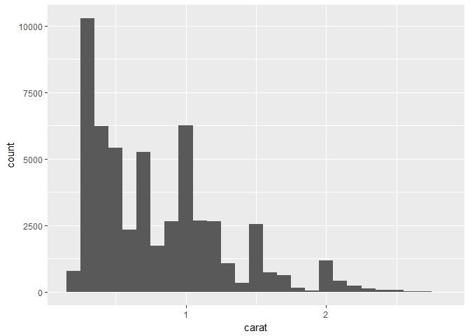<!-- -->

`geom_freqpoly()` is useful for looking at overlaid histograms.

```r
ggplot(smaller, aes(x = carat, color = cut)) + 
  geom_freqpoly(binwidth = 0.1)
```

<!-- -->

#### 7.3.2 Typical values

When looking at data, examine the common trends and look for unexpected patterns or values.

#### 7.3.3 Unusual values

Sometimes the scale can make outliers dificult to see.

```r
ggplot(diamonds) + 
  geom_histogram(aes(x = y), binwidth = 0.5)

ggplot(diamonds) + 
  geom_histogram(aes(x = y), binwidth = 0.5) + 
  coord_cartesian(ylim = c(0, 50))
```

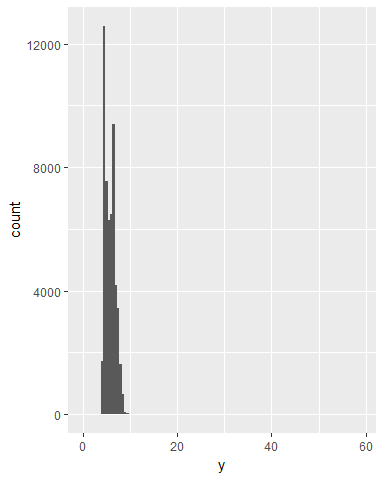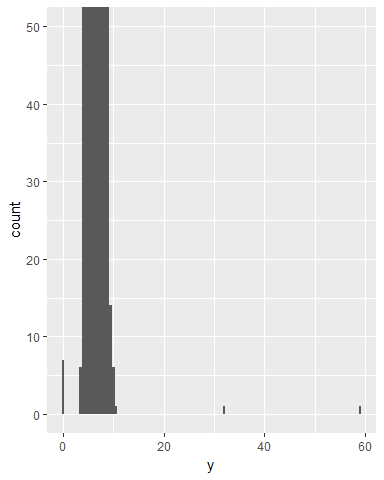

`coord_cartesian()` can be used to zoom into the x or y axis. 

The outliers can be pulled out with dplyr.

```r
unusual <- diamonds %>% 
  filter(y < 3 | y > 20) %>% 
  select(price, x, y , z) %>% 
  arrange(y)
unusual
```

```
## # A tibble: 9 × 4
##   price     x     y     z
##   <int> <dbl> <dbl> <dbl>
## 1  5139  0.00   0.0  0.00
## 2  6381  0.00   0.0  0.00
## 3 12800  0.00   0.0  0.00
## 4 15686  0.00   0.0  0.00
## 5 18034  0.00   0.0  0.00
## 6  2130  0.00   0.0  0.00
## 7  2130  0.00   0.0  0.00
## 8  2075  5.15  31.8  5.12
## 9 12210  8.09  58.9  8.06
```

#### 7.3.4 Exercises

1. `x` and `y` have similar distributions, but there are more outliers in `y` that expand the total spread of the data. In comparison, `z` has a tighter distribution and less variation than `x` or `y`. This dataset is looking at round diamonds, so the length and width should be roughly equivalent. The longest diameter measurement could be specified as the length and the width could be the measurement perpendicular to the length. The depth could be the length from the point of the diamond to the table. 

```r
# exploring x
ggplot(diamonds) +
  geom_histogram(aes(x = x), binwidth = 0.5)

ggplot(diamonds) + 
  geom_histogram(aes(x = x), binwidth = 0.5) +
  coord_cartesian(ylim = c(0, 100))
```

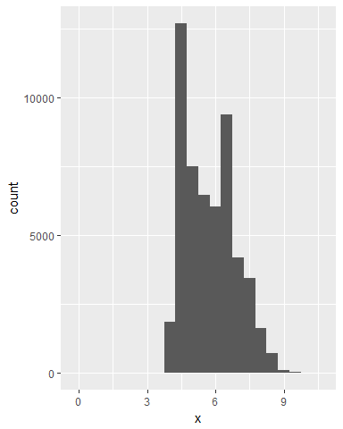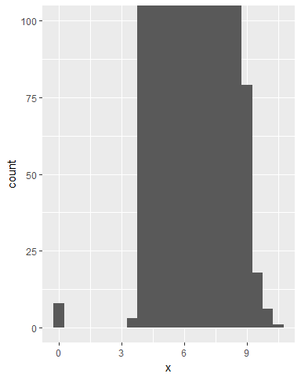

```r
# exploring y
ggplot(diamonds) +
  geom_histogram(aes(x = y), binwidth = 0.5)

ggplot(diamonds) + 
  geom_histogram(aes(x = y), binwidth = 0.5) +
  coord_cartesian(ylim = c(0, 100))
```

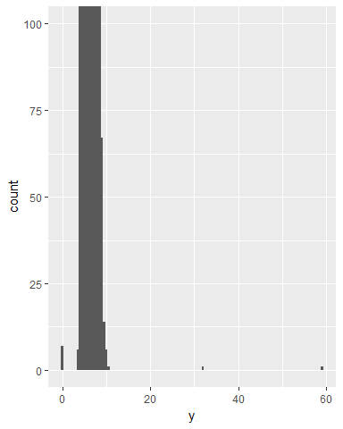

```r
# exploring z
ggplot(diamonds) +
  geom_histogram(aes(x = z), binwidth = 0.5)

ggplot(diamonds) + 
  geom_histogram(aes(x = z), binwidth = 0.5) +
  coord_cartesian(ylim = c(0, 100))
```

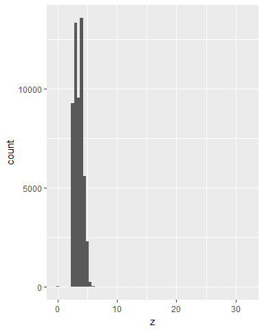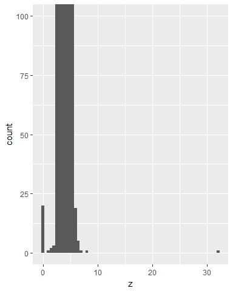

2. There is a region of missing values around $1500, which seems odd.

```r
ggplot(diamonds) + 
  geom_histogram(aes(x = price), binwidth = 1)
```

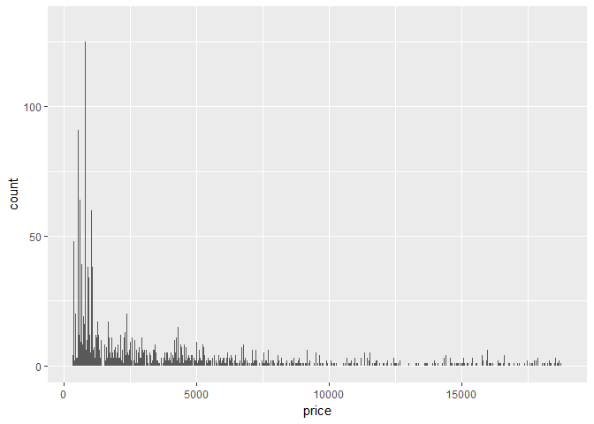<!-- -->

```r
diamonds %>% 
  filter(price > 1300, price < 1700) %>% 
  ggplot() + 
  geom_histogram(aes(x = price), binwidth = 1)
```

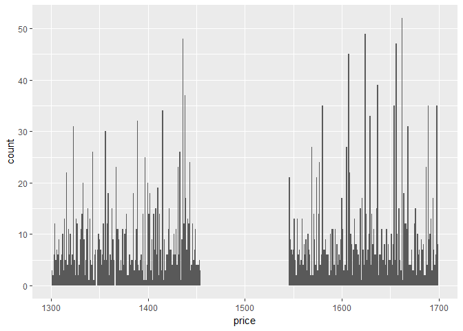<!-- -->

3. There are 23 diamonds that are 0.99 carat and 1558 diamonds that are 1 carat. More people want a 1 carat diamond than a 0.99 carat diamond. Perhaps some of the 0.99 carat diamonds are being rounded up to 1.  

```r
diamonds %>% 
  filter(carat == 0.99) %>% 
  nrow()
```

```
## [1] 23
```

```r
diamonds %>% 
  filter(carat == 1) %>% 
  nrow()
```

```
## [1] 1558
```

4. `coord_cartesian()` will zoom in to a certain range on the graph without affecting the data underlying the graph. This allows for graphed data to extend beyond the view of the graph. In contrast, `xlim()` or `ylim()` will remove the data outside the specified range to create a graph of a certain range. This will actually reduce what is shown in the graph so that only values within the x or y range are shown. However, all of these functions will create a graph with specific x or y range limits. 

```r
ggplot(diamonds) + 
  geom_histogram(aes(x = y), binwidth = 0.5) + 
  coord_cartesian(ylim = c(0, 50))

ggplot(diamonds) + 
  geom_histogram(aes(x = y), binwidth = 0.5) +
  ylim(c(0, 50))
```

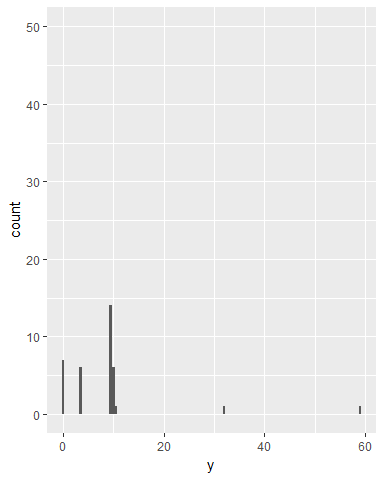

Leaving `binwidth` unset will create a graph where the values are divided into 30 bins by default. 

```r
ggplot(diamonds) + 
  geom_histogram(aes(x = y))
```

```
## `stat_bin()` using `bins = 30`. Pick better value with `binwidth`.
```

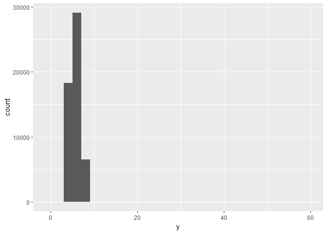<!-- -->

If you zoom into a graph so that only half a bar shows with `coord_cartesian()`, the graph will actually display that half bar. If you zoom into a graph so that only half a bar shows with `xlim()`, the graph will remove the half bar and only show full bars. 

```r
# starting graph
ggplot(diamonds) + 
  geom_histogram(aes(x = y), binwidth = 5)

# zoom to half a bar with coord_cartesian
ggplot(diamonds) + 
  geom_histogram(aes(x = y), binwidth = 5) + 
  coord_cartesian(xlim = c(0, 10))

# zoom to half a bar with xlim
ggplot(diamonds) + 
  geom_histogram(aes(x = y), binwidth = 5) + 
  xlim(0, 10)
```

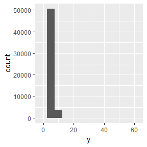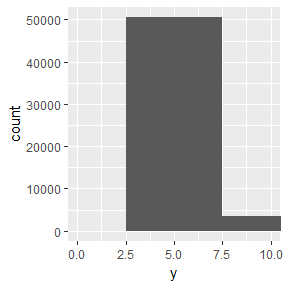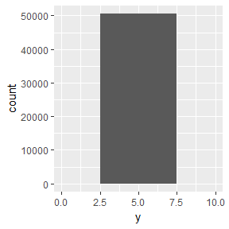

### 7.4 Missing values

There are two different way to handle abnormal values:

* Drop every observation with strange values
* Replace strange values with missing values
```
diamonds2 <- diamonds %>% 
  mutate(y = ifelse(y < 3 | y > 20, NA, y))
```

The first argument of `ifelse()` is a logical evaluation. The second argument of `ifelse()` specifies what to do when the logical evaluation = TRUE. The third argument of `ifelse()` specifies what to do when the logical evalution = FALSE. 

Specifying `na.rm = TRUE` in `ggplot` will remove NA values when plotting a graph.

To compare observations with missing values to those without missing values, you can use `is.na()`. 

```r
library(nycflights13)

flights %>% 
  mutate(
    canceled = is.na(dep_time),
    sched_hour = sched_dep_time %/% 100,
    sched_min = sched_dep_time %% 100,
    sched_dep_time = sched_hour + sched_min / 60
  ) %>% 
  ggplot(aes(sched_dep_time)) + 
  geom_freqpoly(aes(color = canceled), binwidth = 0.25)
```

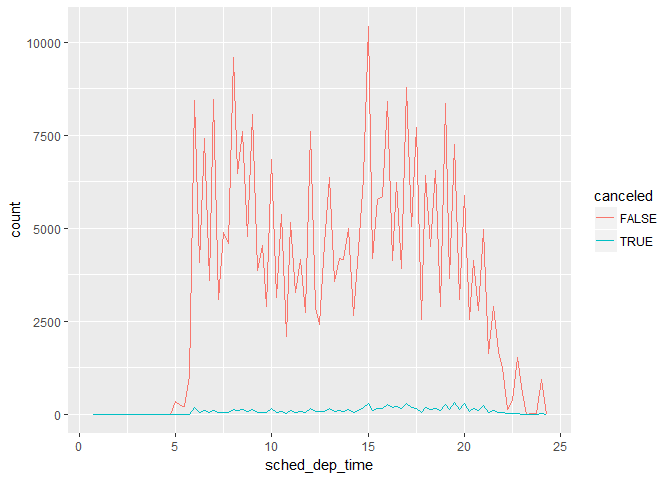<!-- -->

#### 7.4.1 Exercises

1. Missing values are removed from a histogram under `stat_bin`, while missing values are removed from a bar chart under `stat_count`. 

I'm not really seeing the difference between these. What am I missing?

```r
diamonds2 <- diamonds %>% 
  mutate(y = ifelse(y < 3 | y > 20, NA, y))

ggplot(diamonds2) + 
  geom_histogram(aes(x = y))
```

```
## `stat_bin()` using `bins = 30`. Pick better value with `binwidth`.
```

```
## Warning: Removed 9 rows containing non-finite values (stat_bin).
```

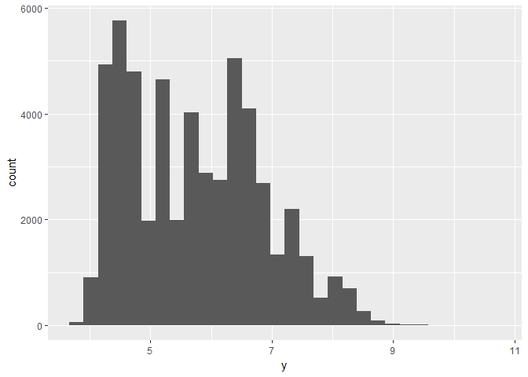<!-- -->

```r
ggplot(diamonds2) + 
  geom_bar(aes(x = y))
```

```
## Warning: Removed 9 rows containing non-finite values (stat_count).
```

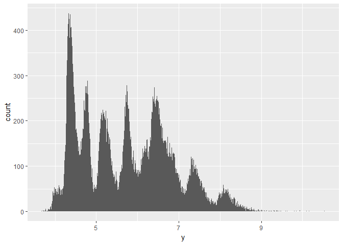<!-- -->

2. `na.rm = TRUE` removes NA values from `mean()` and `sum()` before performing the calculation. 

### 7.5 Covariation

