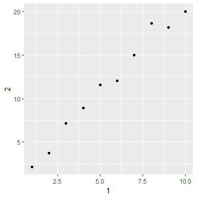

# Exploratory Data Analysis cont. + Tibble
CB  
Tuesday, May 30, 2017  


## Chapter 7 Exploratory Data Analysis

### 7.6 Patterns and models

Patterns within data can be informative for determining relationships between variables. 


```r
ggplot(faithful) + 
  geom_point(aes(x = eruptions, y = waiting))
```

<!-- -->

Covariation can be used to reduce uncertainty because one variable can be used to predict values for the second variable.

Models can be used to separate variable effects and remove interfering relationships.


```r
library(modelr)

mod <- lm(log(price) ~ log(carat), diamonds)

diamonds2 <- diamonds %>% 
  add_residuals(mod) %>% 
  mutate(resid = exp(resid))

ggplot(diamonds2) + 
  geom_point(aes(x = carat, y = resid))
```

<!-- -->

Now see the expected relationship between cut and price without the effect of carat on price.

```r
ggplot(diamonds2) + 
  geom_boxplot(aes(x = cut, y = resid))
```

<!-- -->

### 7.7 `ggplot2` calls

Not all arguments need to be specified in `ggplot` functions, as `ggplot` assumes some arguments are in specific locations. For `ggplot()`, the first argument is assumed to be `data` and the second argument is assumed to be `mapping`. For `aes()`, the first argument is assumed to be `x` and the second argument is assumed to be `y`. 
```
ggplot(data = faithful, mapping = aes(x = eruptions)) + 
geom_freqpoly(binwidth = 0.25) 
```
```
ggplot(faithful, aes(eruptions)) + 
geom_freqpoly(binwidth = 0.25)
```

### 7.8 Learning more

Check out the ggplot2 book, *R Graphics Cookbook*, and *Graphical Data Analysis with R* for additional information.

## Chapter 8 Workflow: projects

R can be very useful for saving analyses and keeping multiple analyses separate. 

### 8.1 What is real?

It's important to remember that scripts are saved, but the environment in R is not. However, the environment can be recreated from saved scripts. 

You can check to make sure all important pieces of code are included in your script by restarting R and rerunning your script. 

* `Ctrl` + `Shift` + `F10` to restart RStudio
* `Ctrl` + `Shift` + `S` to rerun current script

### 8.2 Where does your analysis live?

It's useful to organize each separate project into its own directory and set that directory as the working directory when working on that project.

### 8.3 Paths and directories

Including an absolute path in a script makes it difficult to share the script with others, as that absolute file path will not work for them. 

### 8.4 RStudio projects

Projects within R are very useful for keeping all files associated with one project together in one place. 

If you save figures from within R using code instead of the GUI, it will be much easier to trace the origin of figure files in the future. Using an R markdown document instead of a script can also be useful for creating a workbook where the script and figures it creates are stored in one place. 

### 8.5 Summary

Be diligent with creating a separate R project for each analysis project. This will make sure all files and information you need for that project are stored together and easy to find. This will also help keep each analysis project separate from other analysis projects. 

## Chapter 10 Tibbles

### 10.1 Introduction

Tibbles are data frames, but are slightly different from base R data frames in ways that make them easier to work with.

#### 10.1.1 Prerequisites

The `tibble` package is already included in `tidyverse`. 

### 10.2 Creating tibbles

You can change a data frame into a tibble by using `as_tibble()`. 

```r
as_tibble(iris)
```

```
## # A tibble: 150 × 5
##    Sepal.Length Sepal.Width Petal.Length Petal.Width Species
##           <dbl>       <dbl>        <dbl>       <dbl>  <fctr>
## 1           5.1         3.5          1.4         0.2  setosa
## 2           4.9         3.0          1.4         0.2  setosa
## 3           4.7         3.2          1.3         0.2  setosa
## 4           4.6         3.1          1.5         0.2  setosa
## 5           5.0         3.6          1.4         0.2  setosa
## 6           5.4         3.9          1.7         0.4  setosa
## 7           4.6         3.4          1.4         0.3  setosa
## 8           5.0         3.4          1.5         0.2  setosa
## 9           4.4         2.9          1.4         0.2  setosa
## 10          4.9         3.1          1.5         0.1  setosa
## # ... with 140 more rows
```

Use `tibble()` to create a new tibble from vectors. Vectors of length 1 will be recycled automatically, but vectors of an intermediate length compared to the rest of the tibble will not be recycled and will produce an error. 

```r
tibble(
  x = 1:5,
  y = 1,
  z = x ^ 2 + y
)
```

```
## # A tibble: 5 × 3
##       x     y     z
##   <int> <dbl> <dbl>
## 1     1     1     2
## 2     2     1     5
## 3     3     1    10
## 4     4     1    17
## 5     5     1    26
```

Unlike `data.frame()`, `tibble()` will not change input types or variable names. `tibble()` will also not create row names.

A tibble can have column names that are not valid in R, but they must be enclosed in backticks.

```r
(tb <- tibble(
  `:)` = "smile",
  ` ` = "space",
  `2000` = "number"
))
```

```
## # A tibble: 1 × 3
##    `:)`   ` ` `2000`
##   <chr> <chr>  <chr>
## 1 smile space number
```

`tribble()` will create transposed tibbles, which are easy to read as code.

```r
tribble(
  ~x, ~y, ~z,
  #--/--/----
  "a", 2, 3.6,
  "b", 1, 8.5
)
```

```
## # A tibble: 2 × 3
##       x     y     z
##   <chr> <dbl> <dbl>
## 1     a     2   3.6
## 2     b     1   8.5
```

The comment line starting with `#` isn't necessary, but makes it easy to tell where the header is.

### 10.3 Tibbles vs. `data.frame`

#### 10.3.1 Printing

When a tibble is printed, only the first ten rows and the columns that fit on screen will be shown. Also, the type of each column variable will be shown below the column name. The default for printing tibbles is designed to prevent overloading the console when displaying large data frames, but there are options to override the defaults. 

Using `print()` will allow you to set the number of rows and columns that are shown. `width = Inf` will show all columns.

```r
flights %>% 
  print(n = 1, width = Inf)
```

```
## # A tibble: 336,776 × 19
##    year month   day dep_time sched_dep_time dep_delay arr_time
##   <int> <int> <int>    <int>          <int>     <dbl>    <int>
## 1  2013     1     1      517            515         2      830
##   sched_arr_time arr_delay carrier flight tailnum origin  dest air_time
##            <int>     <dbl>   <chr>  <int>   <chr>  <chr> <chr>    <dbl>
## 1            819        11      UA   1545  N14228    EWR   IAH      227
##   distance  hour minute           time_hour
##      <dbl> <dbl>  <dbl>              <dttm>
## 1     1400     5     15 2013-01-01 05:00:00
## # ... with 3.368e+05 more rows
```

The below option specifies only printing `n` rows if there are more than `m` rows.
```
options(tibble.print_max = n, tibble_print_min = m)
```

To always show all rows, use `options(dplyr.print_min = Inf)`. To always show all columns, use `options(tibble.width = Inf)`. 

RStudio also has the command `View()` to look at an entire dataset.

#### 10.3.2 Subsetting

Use subsetting to pull out single variables from a data frame.

```r
df <- tibble(
  x = runif(5),
  y = rnorm(5)
)

df$x
```

```
## [1] 0.4660152 0.1562708 0.7276627 0.3153478 0.7706057
```

```r
df[["x"]]
```

```
## [1] 0.4660152 0.1562708 0.7276627 0.3153478 0.7706057
```

Variables can also be specified by position instead of by name.

```r
df[[1]]
```

```
## [1] 0.4660152 0.1562708 0.7276627 0.3153478 0.7706057
```

To subset within a pipe chain, `.` must be used as a placeholder.

```r
df %>% .$x
```

```
## [1] 0.4660152 0.1562708 0.7276627 0.3153478 0.7706057
```

```r
df %>% .[["x"]]
```

```
## [1] 0.4660152 0.1562708 0.7276627 0.3153478 0.7706057
```

Tibbles will not partially match something and will warn you if you're trying to access something that doesn't exist.

### 10.4 Interacting with older code

If you need to use an older function that doesn't work with tibbles, you can change the tibble to a data frame with `as.data.frame()`. 

```r
class(as.data.frame(tb))
```

```
## [1] "data.frame"
```

Functions won't always work with tibbles because of the differences with `[` between data frames and tibbles. When working with data frames, `[` sometimes returns a data frame and sometimes returns a vector. with tibbles, `[` always returns a tibble.

### 10.5 Exercises

1. When you print a tibble, it says "A tibble" and gives the dimensions before printing the tibble. When you print a data frame, it lacks this header. You can also check to see if something is a tibble or data frame with `class()`. 

```r
print(df, n = 1)
```

```
## # A tibble: 5 × 2
##           x        y
##       <dbl>    <dbl>
## 1 0.4660152 1.324679
## # ... with 4 more rows
```

```r
class(df)
```

```
## [1] "tbl_df"     "tbl"        "data.frame"
```

```r
class(mtcars)
```

```
## [1] "data.frame"
```

2. The data frame will partially match variables, while the tibble will not. The default data frame behavior could be frustrating because it may accidentally select the wrong column with partial matching. When selecting a column with `[`, a vector will be created from the data frame and a tibble will be created from the tibble. Then when selecting multiple columns with `[`, a data frame will be created from the data frame and a tibble will be created from the tibble. There doesn't seem to be a huge difference here, but it would be nice to know that the output of subsetting with `[` is always a tibble. 

```r
df <- data.frame(abc = 1, xyz = "a")
tib <- as_tibble(df)

df$x
```

```
## [1] a
## Levels: a
```

```r
df[, "xyz"]
```

```
## [1] a
## Levels: a
```

```r
tib[, "xyz"]
```

```
## # A tibble: 1 × 1
##      xyz
##   <fctr>
## 1      a
```

```r
df[, c("abc", "xyz")]
```

```
##   abc xyz
## 1   1   a
```

```r
tib[, c("abc", "xyz")]
```

```
## # A tibble: 1 × 2
##     abc    xyz
##   <dbl> <fctr>
## 1     1      a
```

3. When the name of a variable is stored in an object, you can extract the reference variable from a tibble using `[[]]`. 

```r
var <- "mpg"
cars <- as_tibble(mtcars)

cars[[var]]
```

```
##  [1] 21.0 21.0 22.8 21.4 18.7 18.1 14.3 24.4 22.8 19.2 17.8 16.4 17.3 15.2
## [15] 10.4 10.4 14.7 32.4 30.4 33.9 21.5 15.5 15.2 13.3 19.2 27.3 26.0 30.4
## [29] 15.8 19.7 15.0 21.4
```

4. Extract non-syntactic variable names

```r
annoying <- tibble(
  `1` = 1:10,
  `2` = `1` * 2 + rnorm(length(`1`))
)
```

* Extract `1`

```r
annoying$`1`
```

```
##  [1]  1  2  3  4  5  6  7  8  9 10
```

* Plot scatterplot of `1` vs `2`

```r
ggplot(annoying, aes(x = `1`, y = `2`)) + 
  geom_point()
```

<!-- -->

* Create `3` as `2` divided by `1`

```r
(annoying <- 
  annoying %>% 
  mutate(
    `3` = `2` / `1`
  ))
```

```
## # A tibble: 10 × 3
##      `1`       `2`      `3`
##    <int>     <dbl>    <dbl>
## 1      1  2.145658 2.145658
## 2      2  3.692756 1.846378
## 3      3  6.724963 2.241654
## 4      4  7.052423 1.763106
## 5      5 10.525359 2.105072
## 6      6 11.221900 1.870317
## 7      7 14.302413 2.043202
## 8      8 16.751401 2.093925
## 9      9 18.675664 2.075074
## 10    10 19.217909 1.921791
```

* Rename columns to `one`, `two`, and `three`

```r
annoying %>% 
  rename(one = `1`,
         two = `2`,
         three = `3`)
```

```
## # A tibble: 10 × 3
##      one       two    three
##    <int>     <dbl>    <dbl>
## 1      1  2.145658 2.145658
## 2      2  3.692756 1.846378
## 3      3  6.724963 2.241654
## 4      4  7.052423 1.763106
## 5      5 10.525359 2.105072
## 6      6 11.221900 1.870317
## 7      7 14.302413 2.043202
## 8      8 16.751401 2.093925
## 9      9 18.675664 2.075074
## 10    10 19.217909 1.921791
```

5. `tibble::enframe()` creates a tibble from a vector. More specifically, it can create a tibble from a named vector so that the name and value assigned in the vector are arranged in a row together. This could be used to tidy up a named vector and make it easier to work with. 

6. The `tibble.max_extra_cols` option controls how many additional column names are printed at the footer of a tibble. This can also be modified per tibble with `n_extra`. 
